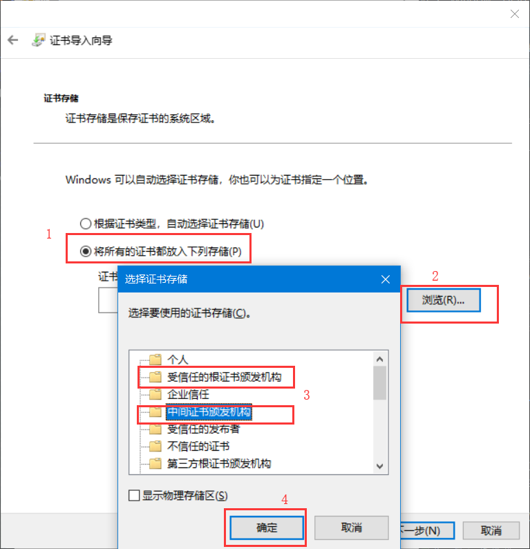

# 介绍

在Windows10中安装Docker for Windows

## 前提

1. Windows10专业版，需要hyper-V

```
如果不是Windows专业版可以参考
1. baidu：win10家庭版安装docker for Windows
2. 使用密钥升级为专业版
```

## 本文版本

 ```
1. Windows10专业版：18362.959
2. Docker for Windows：19.03.8
 ```

# 安装

1. 到[官网](https://www.docker.com/products/docker-desktop)下载Docker for Windows

2. 安装(下一步 下一步 下一步)


# 挂载

```
1. 进入 Settings -> Resources -> File sharing -> 选择挂载的目录
2. 使用命令运行MySQL5.7.14

此处挂载目录为"D:/Docker"
docker run -d -p 3306:3306 --privileged=true -v D:/Docker/MySQL/MySQL8/conf/my.cnf:/etc/mysql/my.cnf -v D:/Docker/MySQL/MySQL8/data:/var/lib/mysql/ -v D:/Docker/MySQL/MySQL8/mysql-files:/var/lib/mysql-files/ -e MYSQL_ROOT_PASSWORD=root --name mysql5 -e TZ=Asia/Shanghai mysql:5.7.14
```
# 安装CA证书

[How do I add custom CA certificates?](https://docs.docker.com/docker-for-windows/faqs/#how-do-i-add-custom-ca-certificates)

翻译如下：

Docker Desktop支持所有受信任的证书颁发机构（CA）（根或中级）。
Docker识别存储在“受信任的根证书颁发机构”或“中间证书颁发机构”下的证书。

1. 在Windows中双击`.crt`文件

2. 第三步选择 `中间证书颁发机构` 或 `受信任的根证书颁发机构`
    

3. 重启 docker 和 PowerShell\(或CMD)

# 其他情况

1. 出现unable to resolve docker endpoint: ca.pe错误

   [解决方法](https://blog.csdn.net/u014418725/article/details/100136095)

   原因：之前使用toolbox安装Docker，未卸载干净